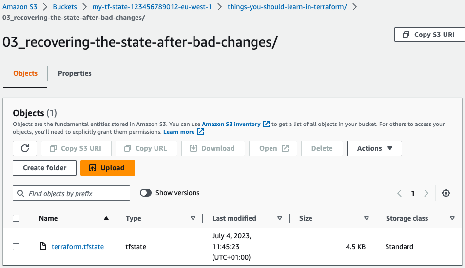
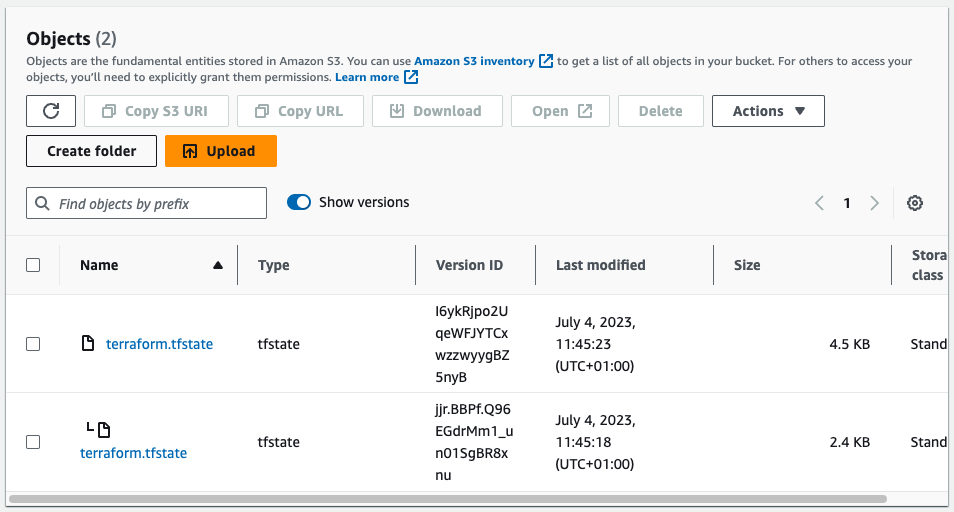

[Previous Exercise] | [Home] | [Next Exercise]

[Previous Exercise]: ../02_pull-and-inspect-state/README.md

[Home]: ../../README.md

[Next Exercise]: ../04_keep-a-resource/README.md

---


# Exercise 3 - recovering the state after bad changes

⚠️ **This exercise requires that you've completed exercise 1** ⚠️

Before we get stuck into this exercise, modify the `terraform.tf` file to have
your account ID and region. Initialise Terraform:

```bash
# Only if you haven't done this already
git clone git@github.com:jSherz/things-you-should-learn-in-terraform.git
cd exercises/03_recovering-the-state-after-bad-changes

# Download any required provider(s)
terraform init
```

**Don't run an apply.** Create two topics with the CLI called `topic-a` and
`topic-b`:

```bash
aws sns create-topic --name topic-a
aws sns create-topic --name topic-b
```

In `main.tf`, we have Terraform code that would create the above topics. Let's
import them, but we're going to get it wrong on purpose:

```bash
ACCOUNT_ID=$(aws sts get-caller-identity --query 'Account' --output text)
REGION=$(aws configure get region)

terraform import aws_sns_topic.a arn:aws:sns:${REGION}:${ACCOUNT_ID}:topic-a
terraform import aws_sns_topic.b arn:aws:sns:${REGION}:${ACCOUNT_ID}:topic-a
```

Uh-oh! We've just imported `topic-a` for both A and B! How can we revert the
state to the previous version and undo our mistake?

Navigate to the AWS web interface, and find the state bucket:


You can find the path we're looking for in the `key` property in
`terraform.tf` - in this case it'll be the folder
`things-you-should-learn-in-terraform` and then the nested folder
`03_recovering-the-state-after-bad-changes`. In that folder you'll see one
file:



Clicking "Show versions" lets us see the full history of our file:



The file changed at 11:45:18 is the one _before_ our mistake, and the one at
11:45:23 is the one _after_ the mistake. We want to get back to the 11:45:18
version. The timestamps will be different for you, but download the earliest
version of the state file you have.

Try and push the file back into Terraform's state storage:

```bash
terraform state push terraform.tfstate
```

**NB:** With some browser and operating system combinations, the file name may
be slightly different, e.g. terraform.tfstate.json or terraform.json.

You'll get an error that looks like this:

```
Failed to write state: cannot import state with serial 1 over newer state with serial 2
```

Open up the state file and change the serial to `3`:

```json5
{
  "version": 4,
  "terraform_version": "1.5.2",
  "serial": 3,
  "lineage": "59908130-13c0-139a-3d96-f0bc740a3e8a",
  "outputs": {}
  // ...
}
```

Retry the push operation:

```bash
terraform state push terraform.tfstate
```

With that back to how it was, try a plan:

```bash
terraform plan
```

You should see that it now wants to try and create `topic-b`:

```
aws_sns_topic.a: Refreshing state... [id=arn:aws:sns:eu-west-1:123456789012:topic-a]

Terraform used the selected providers to generate the following execution plan. Resource actions are indicated with the following symbols:
  + create

Terraform will perform the following actions:

  # aws_sns_topic.b will be created
  + resource "aws_sns_topic" "b" {
      + arn                         = (known after apply)
      + content_based_deduplication = false
      + fifo_topic                  = false
      + id                          = (known after apply)
      + name                        = "topic-b"
      + name_prefix                 = (known after apply)
      + owner                       = (known after apply)
      + policy                      = (known after apply)
      + signature_version           = (known after apply)
      + tags_all                    = (known after apply)
      + tracing_config              = (known after apply)
    }

Plan: 1 to add, 0 to change, 0 to destroy.

──────────────────────────────────────────────────────────────────────────────────────────────────────────────────────────────────────────────────────────────────────────────────────────────────────────────────────────────────────────────────────────────────────────────────────────────────────────────────────────────────────────────────────────────────────────────────────────────────────────────────────────────────────────────────────────────────────────────────

Note: You didn't use the -out option to save this plan, so Terraform can't guarantee to take exactly these actions if you run "terraform apply" now.
```

We can run the correct import command to finish what we were trying to do
originally:

```bash
ACCOUNT_ID=$(aws sts get-caller-identity --query 'Account' --output text)
REGION=$(aws configure get region)

terraform import aws_sns_topic.b arn:aws:sns:${REGION}:${ACCOUNT_ID}:topic-b
```

## 🍎 What did we learn?

* Remote state backends need to be configured appropriately to store old
  versions / backups.

  In S3, we use versioning to achieve this.

* We can view old versions of our `terraform.tfstate` file in the AWS web
  interface.

  **NB:** you can use the CLI or SDK for this if you choose, but I find the web
  interface more user-friendly for this.

* We can use `terraform state push <file>` to overwrite the current state.

* We must increment the `serial` value in our state file to be higher than the
  existing version when we push changes.

---

[Previous Exercise] | [Home] | [Next Exercise]
