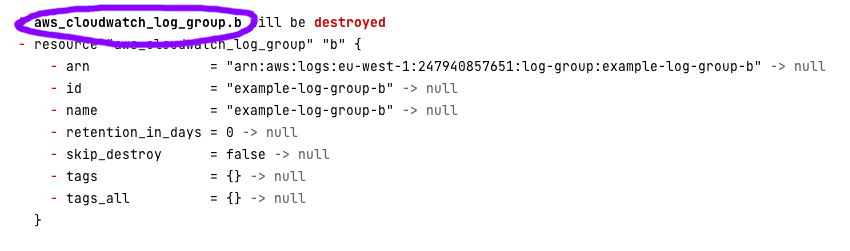

[Previous Exercise] | [Home] | [Next Exercise]

[Previous Exercise]: ../03_recovering-the-state-after-bad-changes/README.md
[Home]: ../../README.md
[Next Exercise]: ../05_move-a-resource-into-a-module/README.md

---


# Exercise 4 - keep a resource when the Terraform code for it is deleted

⚠️ **This exercise requires that you've completed exercise 1** ⚠️

Start this exercise like we've done in the last few by setting your account ID
and region in `terraform.tf`. Run an init:

```bash
# Only if you haven't done this already
git clone git@github.com:jSherz/things-you-should-learn-in-terraform.git
cd exercises/04_keep-a-resource

# Download any required provider(s)
terraform init
```

Add a few resources to the `main.tf` file:

```terraform
resource "aws_cloudwatch_log_group" "a" {
  name = "example-log-group-a"
}

resource "aws_cloudwatch_log_group" "b" {
  name = "example-log-group-b"
}

resource "aws_cloudwatch_log_group" "c" {
  name = "example-log-group-c"
}
```

Run a Terraform apply:

```bash
terraform apply
```

We've now created CloudWatch Log Groups. You can imagine that we'd had a use
case like storing logs for an Application Load Balancer or Lambda function.
We've decided to delete that infrastructure, but we don't want to lose one of
the log groups, `example-log-group-b`. How can we run a Terraform destroy
without it being deleted?

Let's start by seeing a plan for destroying the infrastructure:

```bash
terraform plan -destroy
```

You should see the following:

```
aws_cloudwatch_log_group.b: Refreshing state... [id=example-log-group-b]
aws_cloudwatch_log_group.c: Refreshing state... [id=example-log-group-c]
aws_cloudwatch_log_group.a: Refreshing state... [id=example-log-group-a]

Terraform used the selected providers to generate the following execution plan. Resource actions are indicated with the following symbols:
  - destroy

Terraform will perform the following actions:

  # aws_cloudwatch_log_group.a will be destroyed
  - resource "aws_cloudwatch_log_group" "a" {
      - arn               = "arn:aws:logs:eu-west-1:123456789012:log-group:example-log-group-a" -> null
      - id                = "example-log-group-a" -> null
      - name              = "example-log-group-a" -> null
      - retention_in_days = 0 -> null
      - skip_destroy      = false -> null
      - tags              = {} -> null
      - tags_all          = {} -> null
    }

  # aws_cloudwatch_log_group.b will be destroyed
  - resource "aws_cloudwatch_log_group" "b" {
      - arn               = "arn:aws:logs:eu-west-1:123456789012:log-group:example-log-group-b" -> null
      - id                = "example-log-group-b" -> null
      - name              = "example-log-group-b" -> null
      - retention_in_days = 0 -> null
      - skip_destroy      = false -> null
      - tags              = {} -> null
      - tags_all          = {} -> null
    }

  # aws_cloudwatch_log_group.c will be destroyed
  - resource "aws_cloudwatch_log_group" "c" {
      - arn               = "arn:aws:logs:eu-west-1:123456789012:log-group:example-log-group-c" -> null
      - id                = "example-log-group-c" -> null
      - name              = "example-log-group-c" -> null
      - retention_in_days = 0 -> null
      - skip_destroy      = false -> null
      - tags              = {} -> null
      - tags_all          = {} -> null
    }

Plan: 0 to add, 0 to change, 3 to destroy.

──────────────────────────────────────────────────────────────────────────────────────────────────────────────────────────────────────────────────────────────────────────────────────────────────────────────────────────────────────────────────────────────────────────────────────────────────────────────────────────────────────────────────────────────────────────────────────────────────────────────────────────────────────────────────────────────────────────────────

Note: You didn't use the -out option to save this plan, so Terraform can't guarantee to take exactly these actions if you run "terraform apply" now.
```

The bit we're most interested in is here:



This is the full path to the resource. If it were in a module, it might look
something like this:

```
  # module.a.module.b.aws_cloudwatch_log_group.b will be destroyed
```

Take that full path and use it to remove the resource from state:

```bash
terraform state rm aws_cloudwatch_log_group.b
```

Terraform only knows that resources exist by having them in its state. If we
remove the item from the state, Terraform forgets that it has to managed it.
Let's retry our destroy plan:

```bash
terraform plan -destroy
```

We should now only see two CloudWatch Log Groups to be destroyed:

```
aws_cloudwatch_log_group.a: Refreshing state... [id=example-log-group-a]
aws_cloudwatch_log_group.c: Refreshing state... [id=example-log-group-c]

Terraform used the selected providers to generate the following execution plan. Resource actions are indicated with the following symbols:
  - destroy

Terraform will perform the following actions:

  # aws_cloudwatch_log_group.a will be destroyed
  - resource "aws_cloudwatch_log_group" "a" {
      - arn               = "arn:aws:logs:eu-west-1:123456789012:log-group:example-log-group-a" -> null
      - id                = "example-log-group-a" -> null
      - name              = "example-log-group-a" -> null
      - retention_in_days = 0 -> null
      - skip_destroy      = false -> null
      - tags              = {} -> null
      - tags_all          = {} -> null
    }

  # aws_cloudwatch_log_group.c will be destroyed
  - resource "aws_cloudwatch_log_group" "c" {
      - arn               = "arn:aws:logs:eu-west-1:123456789012:log-group:example-log-group-c" -> null
      - id                = "example-log-group-c" -> null
      - name              = "example-log-group-c" -> null
      - retention_in_days = 0 -> null
      - skip_destroy      = false -> null
      - tags              = {} -> null
      - tags_all          = {} -> null
    }

Plan: 0 to add, 0 to change, 2 to destroy.

──────────────────────────────────────────────────────────────────────────────────────────────────────────────────────────────────────────────────────────────────────────────────────────────────────────────────────────────────────────────────────────────────────────────────────────────────────────────────────────────────────────────────────────────────────────────────────────────────────────────────────────────────────────────────────────────────────────────────

Note: You didn't use the -out option to save this plan, so Terraform can't guarantee to take exactly these actions if you run "terraform apply" now.
```

Success! We can now safely apply those changes and keep the resources we care
about.

## 🍎 What did we learn?

* Terraform supports the `-destroy` flag on `plan` and `apply` operations to
  remove resources rather than create them.

* We can use `terraform state rm <path>` to tell Terraform to forget about a
  resource that it's managing.

    * Resources in modules have a longer path that starts with `module.`

    * Running a `terraform plan` is a quick way to see module paths and use
      them in another command.

## Further reading

* [State Command in the Terraform docs](https://developer.hashicorp.com/terraform/cli/commands/state)

---

[Previous Exercise] | [Home] | [Next Exercise]
