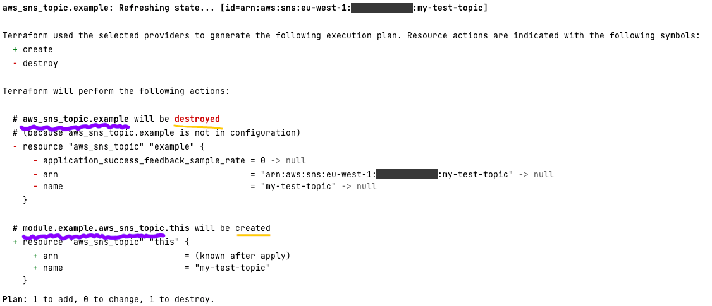

[Previous Exercise] | [Home] | [Next Exercise]

[Previous Exercise]: ../04_keep-a-resource/README.md

[Home]: ../../README.md

[Next Exercise]: ../06_set-variables-based-on-the-current-workspace/README.md

---


# Exercise 5 - move a resource into a module

⚠️ **This exercise requires that you've completed exercise 1** ⚠️

Start this exercise like we've done in the last few by setting your account ID
and region in `terraform.tf`. Run an init:

```bash
# Only if you haven't done this already
git clone git@github.com:jSherz/things-you-should-learn-in-terraform.git
cd exercises/05_move-a-resource-into-a-module

# Download any required provider(s)
terraform init
```

In this scenario, we're going to move an SNS topic resource into a module.
We're doing this to simulate the real-world task of replacing some resource(s)
with a module that creates them in a standardised way. For example, you might
have this sequence of events:

* Create an SNS topic.
* Create a second SNS topic.
* Decide that you're going to make more topics, and that you want them to be
  standardised.
* Create a module for SNS topics.
* Refactor the existing SNS topics to use the module.

Observe that in `main.tf` we have this topic:

```terraform
resource "aws_sns_topic" "example" {
  name = "my-test-topic"
}
```

Run a Terraform apply to create it:

```bash
terraform apply
```

We're going to replace this resource declaration with the module that's
defined in `modules/topic`. Have a read through the files in that module. It
has a variable for the topic name, the topic resource and two outputs.

_modules/topic/main.tf_

```terraform
resource "aws_sns_topic" "this" {
  name = var.name
}
```

_modules/topic/outputs.tf_

```terraform
output "topic_arn" {
  value = aws_sns_topic.this.arn
}

output "topic_name" {
  value = aws_sns_topic.this.name
}
```

_modules/topic/variables.tf_

```terraform
variable "name" {
  type        = string
  description = "Name of the SNS topic to create."
}
```

My favourite method of making this transition is to rely on the Terraform plan.
Replace the resource in `main.tf` with:

```terraform
module "example" {
  source = "./modules/topic"

  name = "my-test-topic"
}
```

Run a Terraform init and plan:

```bash
terraform init

terraform plan
```

You'll get a plan that looks like this one. I've removed a lot of detail from
this to make it easier to read:

```
aws_sns_topic.example: Refreshing state... [id=arn:aws:sns:eu-west-1:123456789012:my-test-topic]

Terraform used the selected providers to generate the following execution plan. Resource actions are indicated with the following symbols:
  + create
  - destroy

Terraform will perform the following actions:

  # aws_sns_topic.example will be destroyed
  # (because aws_sns_topic.example is not in configuration)
  - resource "aws_sns_topic" "example" {
      - arn                                      = "arn:aws:sns:eu-west-1:123456789012:my-test-topic" -> null
      - name                                     = "my-test-topic" -> null
    }

  # module.example.aws_sns_topic.this will be created
  + resource "aws_sns_topic" "this" {
      + arn                         = (known after apply)
      + name                        = "my-test-topic"
    }

Plan: 1 to add, 0 to change, 1 to destroy.

──────────────────────────────────────────────────────────────────────────────────────────────────────────────────────────────────────────────────────────────────────────────────────────────────────────────────────────────────────────────────────────────────────────────────────────────────────────────────────────────────────────────────────────────────────────────────────────────────────────────────────────────────────────────────────────────────────────────────

Note: You didn't use the -out option to save this plan, so Terraform can't guarantee to take exactly these actions if you run "terraform apply" now.
```

We've now got to perform a matching exercise where we find the state path
_before_ and _after_. I've highlighted the two state paths in the picture
below. We're finding resources that are being deleted (old path) and moving
them to ones being created (new path).



In a real scenario you'll likely be moving more than one resource, but it's the
same principle.

We'll plug the before and after paths into a Terraform state move command. This
tells Terraform that it's the same resource being managed, we've just
refactored our code:

```bash
terraform state mv aws_sns_topic.example module.example.aws_sns_topic.this
```

Let's check everything was moved successfully with another plan:

```bash
terraform plan
```

```
module.example.aws_sns_topic.this: Refreshing state... [id=arn:aws:sns:eu-west-1:123456789012:my-test-topic]

No changes. Your infrastructure matches the configuration.

Terraform has compared your real infrastructure against your configuration and found no differences, so no changes are needed.
```

Much better! We've performed our refactoring without the underlying SNS topic
in AWS being modified.

## 🍎 What did we learn?

* We can refactor our Terraform code without disrupting live resources.

    * We can move resources into or out of modules.

    * We can give them a different local name, e.g. "example" changes to "this"
      above.

    * We achieve this with `terraform state mv <old path> <new path>`

## Further reading

* [State Command in the Terraform docs](https://developer.hashicorp.com/terraform/cli/commands/state)

---

[Previous Exercise] | [Home] | [Next Exercise]
