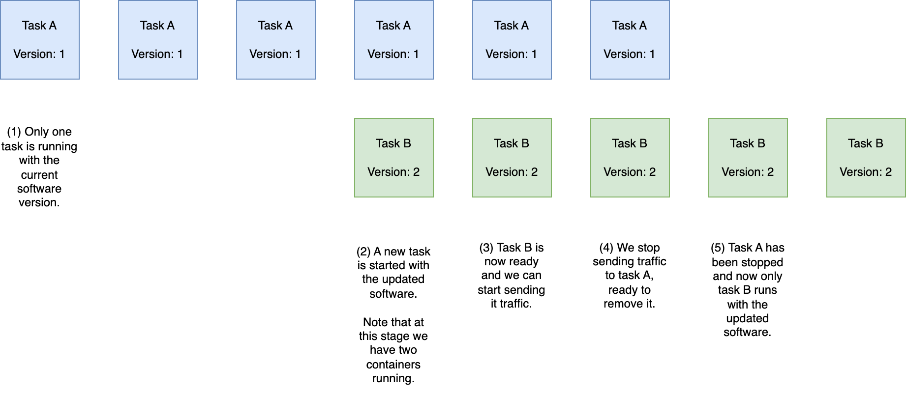
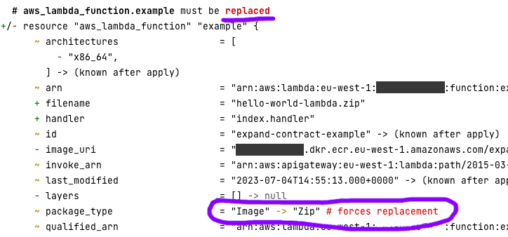

[Previous Exercise] | [Home] | [Next Exercise]

[Previous Exercise]: ../06_set-variables-based-on-the-current-workspace/README.md
[Home]: ../../README.md
[Next Exercise]: ../08_import-existing-resources-no-disruption/README.md

---


# Exercise 6 - expand and contract migrations

⚠️ **This exercise requires that you've completed exercise 1** ⚠️

When we build infrastructure for our users, we're providing them with some
guarantees. For example, users might visit a particular URL like example.com.
They want to keep coming back to the same interface, in this case a domain
name, and to get functioning infrastructure.

If Google did a software release and changed to google2.com, how many people
would type the existing URL with muscle memory and get an error? How many
browser codebases would have to change? I'd wager it's a lot!

Here are some examples of the interfaces or contracts that Cloud/Platform
Engineers provide to their users:

* An API Gateway Custom Domain Name.

* An S3 bucket name, e.g. for cross-account log shipping.

* A hostname, e.g. for a \[web] service.

## ❔ What are expand and contract migrations?

Expand and contract migrations are a method of maintaining service while making
some kind of change, for example a new software release. We do this by
expanding (adding new infrastructure), making the change, and then contracting
(removing some infrastructure).

If you've ever used the Elastic Container Service (ECS), you've experienced
an expand and contract deployment. A new task with the new container(s) is
started, we wait for it to be ready, and then we tear down the old task:



Throughout the duration of this deployment, one container is always running.
That's our contract to the end-user: they can keep making requests or accessing
the service at all times.

## Why would we need expand and contract migrations?

Some infrastructure can be updated in-place, and some must be recreated when
we make a change. For example, we might want to switch a Lambda function from
a Docker image to a ZIP-based deployment. In our ECS example above, we can't
change the containers of a running task - we have to make a new one and switch
over to it.

Let's see this in action. Update the `terraform.tf` to have your account ID and
region, then run an init:

```bash
# Only if you haven't done this already
git clone git@github.com:jSherz/things-you-should-learn-in-terraform.git
cd exercises/07_expand-contract-migrations

# Download any required provider(s)
terraform init
```

Deploy just the ECR repository:

```bash
terraform apply -target aws_ecr_repository.example
```

Populate the repo with a demo container image:

```bash
docker pull jsherz/hello-world-rest-api-lambda:latest
docker tag jsherz/hello-world-rest-api-lambda:latest $(terraform output -raw container_repo_url):latest

ACCOUNT_ID=$(aws sts get-caller-identity --query 'Account' --output text)
REGION=$(aws configure get region)
aws ecr get-login-password --region ${REGION} | docker login --username AWS --password-stdin ${ACCOUNT_ID}.dkr.ecr.${REGION}.amazonaws.com
docker push $(terraform output -raw container_repo_url):latest
```

Deploy the rest of the infrastructure:

```bash
terraform apply
```

You'll see an output called `api_endpoint_url`. Test out that URL and confirm
our Lambda function is working:

```bash
curl -i $(terraform output -raw api_endpoint_url)
```

You should see something like:

```
HTTP/2 200 
content-type: application/json
content-length: 20
date: Tue, 04 Jul 2023 14:56:09 GMT
x-amzn-requestid: af34f5f7-07a9-4fd9-9d48-d516aee84437
x-amz-apigw-id: HizpZGCFDoEFytw=
x-amzn-trace-id: Root=1-64a43308-40130c562c3b5def32ccf4a5;Sampled=0;lineage=50bbcf87:0
x-cache: Miss from cloudfront
via: 1.1 d9fff865f15be92cf9bd52ec2827f356.cloudfront.net (CloudFront)
x-amz-cf-pop: LHR61-P7
x-amz-cf-id: YOjMAKEKEzvlfoVNy1RWdvvgvaG32spsl9Xwql46xZvBq7PYeXrpDw==

"Hello from Lambda!"
```

Change the Lambda function resource in `main.tf` to:

```terraform
resource "aws_lambda_function" "example" {
  function_name    = "expand-contract-example"
  role             = aws_iam_role.example.arn
  memory_size      = 128
  filename         = "hello-world-lambda.zip"
  handler          = "index.handler"
  source_code_hash = filebase64sha256("hello-world-lambda.zip")
  runtime          = "nodejs18.x"

  depends_on = [aws_cloudwatch_log_group.example]
}
```

Try a Terraform plan:

```bash
terraform plan
```

Uh-oh! Terraform wants to replace the resource.



If we applied this plan, our users would face a brief period of disruption
while the function was replaced. We don't want that - so what can we do? The
answer is to create a new Lambda function:

```terraform
resource "aws_cloudwatch_log_group" "example_new" {
  name              = "/aws/lambda/expand-contract-example-new"
  retention_in_days = 30
}

resource "aws_lambda_function" "example_new" {
  function_name    = "expand-contract-example-new"
  role             = aws_iam_role.example.arn
  memory_size      = 128
  filename         = "hello-world-lambda.zip"
  handler          = "index.handler"
  source_code_hash = filebase64sha256("hello-world-lambda.zip")
  runtime          = "nodejs18.x"

  depends_on = [aws_cloudwatch_log_group.example_new]
}

resource "aws_lambda_permission" "example_new" {
  statement_id  = "AllowExecutionFromAPIGateway"
  action        = "lambda:InvokeFunction"
  function_name = aws_lambda_function.example_new.function_name
  principal     = "apigateway.amazonaws.com"

  source_arn = "arn:aws:execute-api:${data.aws_region.this.name}:${data.aws_caller_identity.this.account_id}:${aws_api_gateway_rest_api.example.id}/*/${aws_api_gateway_method.example.http_method}${aws_api_gateway_resource.hello_world.path}"
}
```

Change the original Lambda function back to:

```terraform
resource "aws_lambda_function" "example" {
  function_name = "expand-contract-example"
  role          = aws_iam_role.example.arn
  package_type  = "Image"
  image_uri     = "${aws_ecr_repository.example.repository_url}:latest"
  memory_size   = 128

  depends_on = [aws_cloudwatch_log_group.example]
}
```

We can then safely apply this:

```bash
terraform apply
```

We've done the expand part, and we've made our changes. Our final cleanup, or
the "contract" part is to remove the existing Lambda function, and to run one
final apply.

## 🍎 What did we learn?

* We must understand the interface or contract that we provide to our users to
  deploy infrastructure changes safely.

* A resource being replaced in Terraform might cause disruption to our users.

* We can safely make changes by expanding (creating new infrastructure),
  changing users over, and contracting (removing old infrastructure).

* The `-target` option can be used with Terraform plan or apply to seed some
  specific pieces of infrastructure. Use it sparingly!

## Further reading

* [ParallelChange on MartinFowler.com](https://martinfowler.com/bliki/ParallelChange.html)
* [Command: plan on the Terraform docs](https://developer.hashicorp.com/terraform/cli/commands/plan)

---

[Previous Exercise] | [Home] | [Next Exercise]
