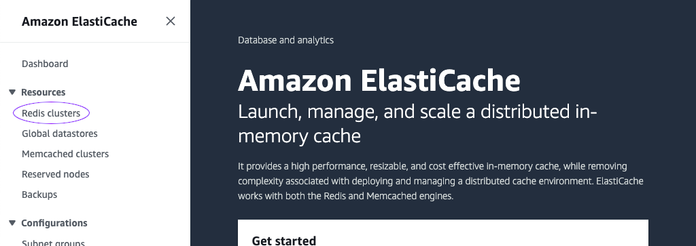
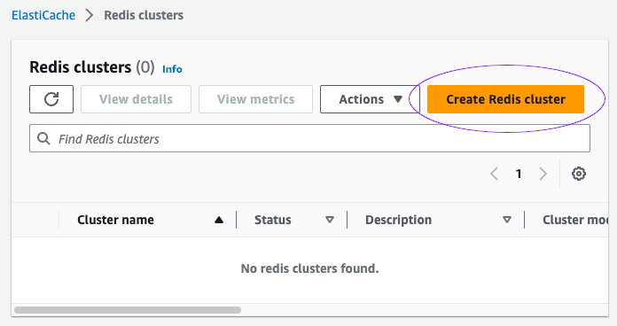
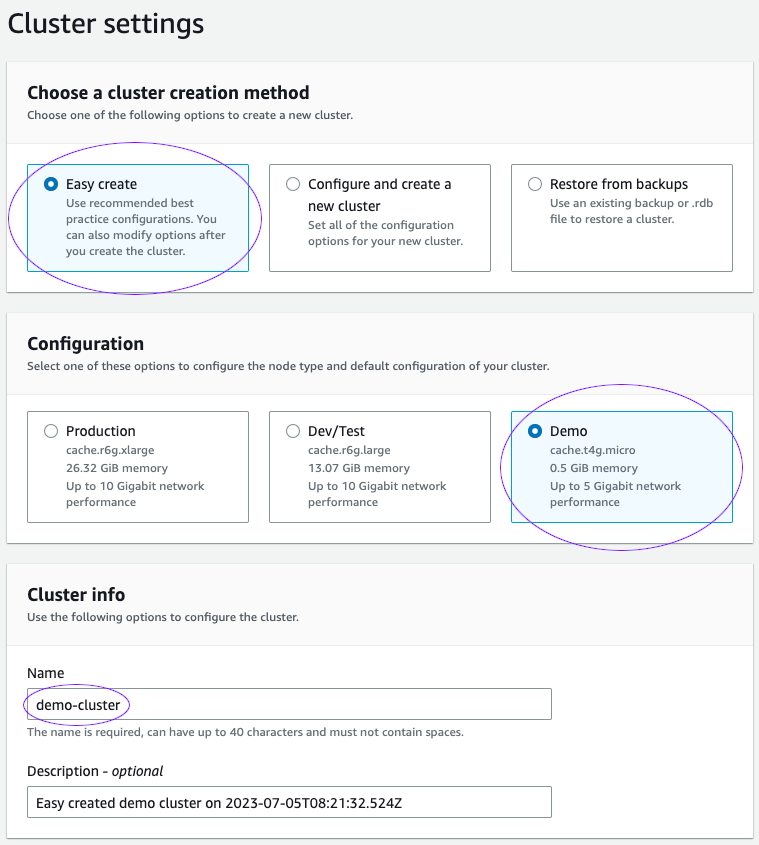
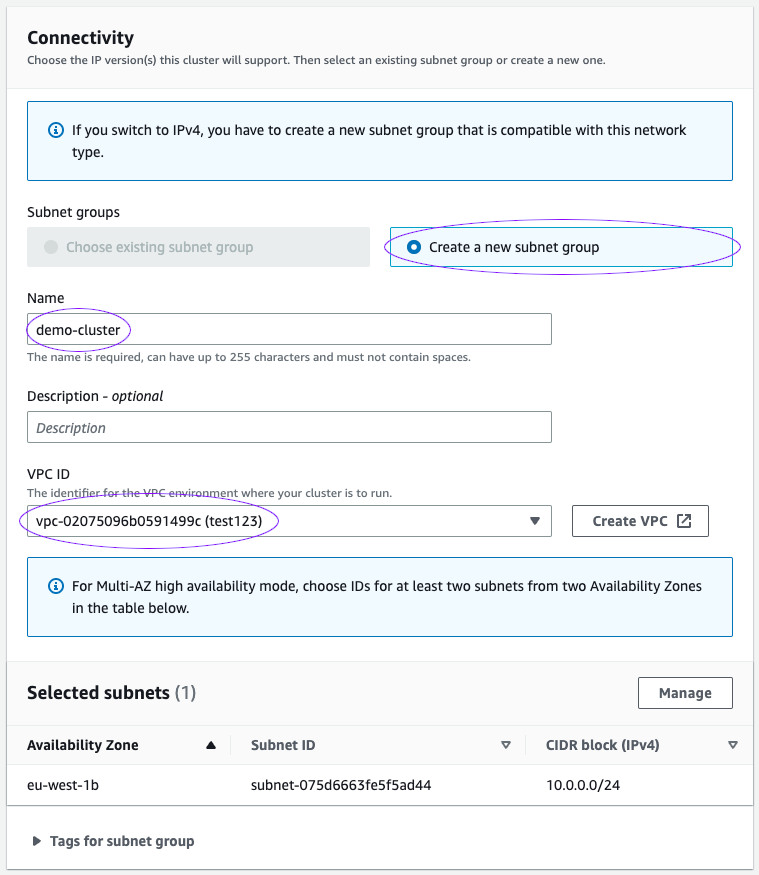
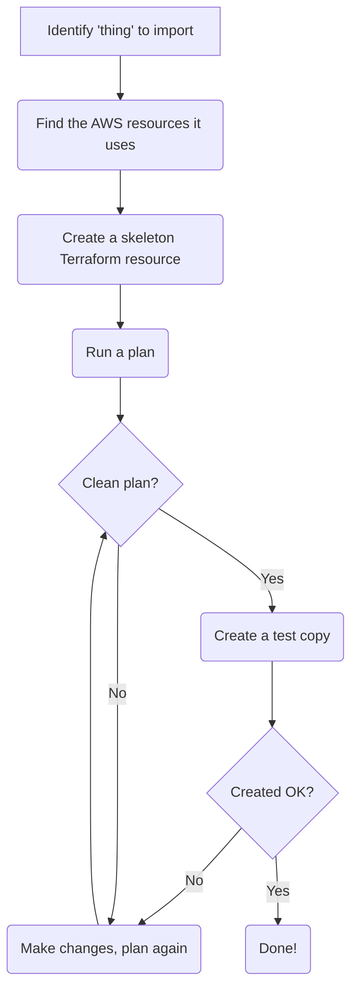

[Previous Exercise] | [Home] | [Next Exercise]

[Previous Exercise]: ../07_expand-contract-migrations/README.md

[Home]: ../../README.md

[Next Exercise]: ../09_fast-feedback-changing-modules/README.md

---


# Exercise 8 - import existing resources with no disruption

⚠️ **This exercise requires that you've completed exercise 1** ⚠️

We're going to adopt some existing infrastructure into Terraform. In this case,
an Elasticache cluster.

## 💰 How much does this cost?

We're going to run a `cache.t4g.micro` node which costs approximately ~$13 a
month. Please don't forget to tear it down after this exercise!

## 🖱️ Getting started

Let's do some "ClickOps" and create an Elasticache cluster in the AWS web
interface.

1. Navigate to the Elasticache console. Select "Redis clusters".

   

2. Choose "Create Redis cluster".

   

3. Select "Easy create", "Demo" and use the cluster name "demo-cluster".

   

4. Enter "demo-cluster" for the subnet group name, and choose an appropriate
   VPC. If you don't have an existing VPC, you can use the "Create VPC" button
   to make one.

   

5. Hit "Create".

6. Wait for the cluster to be created.

## 🌍 Terraform time!

We've now created some infrastructure that we can adopt into Terraform. We ran
through one wizard in the AWS console, but actually created multiple resources
under the hood. Let's use the AWS CLI to see some of these resources:

```bash
aws elasticache describe-cache-clusters

aws elasticache describe-replication-groups

aws elasticache describe-cache-subnet-groups
```

If your account already has a lot of Elasticache resources, you can try showing
just the ones we've created as part of this exercise:

```bash
aws elasticache describe-cache-clusters --cache-cluster-id demo-cluster-0001-001

aws elasticache describe-replication-groups --replication-group-id demo-cluster

aws elasticache describe-cache-subnet-groups --cache-subnet-group-name demo-cluster
```

Start by updating `terraform.tf` with your account ID and region, then
initialise Terraform:

```bash
# Only if you haven't done this already
git clone git@github.com:jSherz/things-you-should-learn-in-terraform.git
cd exercises/08_import-existing-resources-no-disruption

# Download any required provider(s)
terraform init
```

With that in place, we'll try and create some of the existing resources in
Terraform code. I have some tips for that:

* Start by understanding which resource(s) are present:

  For example, we've got three resources showing up in the CLI calls above. We
  can use the Terraform documentation and AWS documentation to understand
  what's important.

  One approach is to review the AWS CLI for your chosen service and to see all
  get / list / describe options. If nothing else, this deepens your knowledge
  of the resources that are available in a service.

* Don't be afraid to run plans!

  You can always get a colleague to read through them with you to gain some
  more confidence before you commit to any changes.

  If you're incorporating this infrastructure into an existing project, it
  might be worth trying to coordinate with your team to avoid them trying to
  make changes concurrently. You want the pressure off when you're importing a
  live resource.

We can see the Elasticache cluster in the `describe-cache-clusters` call above,
but it's actually part of a replication group. This is one of those tricky
areas where you'd need some knowledge of the service upfront, or a good read
through of the documentation.

If we navigate to [the Terraform documentation for Elasticache], we can see the
`aws_elasticache_replication_group` resource which sounds about right for
creating a replication group.

[the Terraform documentation for Elasticache]: https://registry.terraform.io/providers/hashicorp/aws/latest/docs/resources/elasticache_replication_group

Terraform's documentation often has some useful examples we can adapt for our
scenario, so let's take their one for Redis with cluster mode enabled:

```terraform
resource "aws_elasticache_replication_group" "baz" {
  replication_group_id       = "tf-redis-cluster"
  description                = "example description"
  node_type                  = "cache.t2.small"
  port                       = 6379
  parameter_group_name       = "default.redis3.2.cluster.on"
  automatic_failover_enabled = true

  num_node_groups         = 2
  replicas_per_node_group = 1
}
```

We can make a few tweaks to it without too much digging, including setting up
the name (`replication_group_id`) and `paramater_group_name`. We could find
these values from the CLI calls we used earlier, or from the web interface -
your choice!

Add the following to `main.tf`:

```terraform
resource "aws_elasticache_replication_group" "demo" {
  replication_group_id       = "demo-cluster"
  description                = "example description"
  node_type                  = "cache.t2.small"
  port                       = 6379
  parameter_group_name       = "default.redis7.cluster.on"
  automatic_failover_enabled = true

  num_node_groups         = 2
  replicas_per_node_group = 1
}
```

If we run a Terraform plan, you'll see that it wants to create a new group. Fix
that with a quick import:

```bash
terraform import aws_elasticache_replication_group.demo demo-cluster
```

If we run a plan now, we'll get something that looks like this:

```
aws_elasticache_replication_group.demo: Refreshing state... [id=demo-cluster]

Terraform used the selected providers to generate the following execution plan. Resource actions are indicated with the following symbols:
-/+ destroy and then create replacement

Terraform will perform the following actions:

  # aws_elasticache_replication_group.demo must be replaced
-/+ resource "aws_elasticache_replication_group" "demo" {
      + apply_immediately              = (known after apply)
      ~ arn                            = "arn:aws:elasticache:eu-west-1:123456789012:replicationgroup:demo-cluster" -> (known after apply)
      ~ at_rest_encryption_enabled     = true -> (known after apply)
      ~ auto_minor_version_upgrade     = "true" -> (known after apply)
      ~ cluster_enabled                = true -> (known after apply)
      ~ configuration_endpoint_address = "demo-cluster.thk45i.clustercfg.euw1.cache.amazonaws.com" -> (known after apply)
      ~ data_tiering_enabled           = false -> (known after apply)
      ~ description                    = "Easy created demo cluster on 2023-07-05T08:21:32.524Z" -> "example description"
      ~ engine_version                 = "7.0" -> (known after apply)
      ~ engine_version_actual          = "7.0.7" -> (known after apply)
      + global_replication_group_id    = (known after apply)
      ~ id                             = "demo-cluster" -> (known after apply)
      ~ maintenance_window             = "thu:23:00-fri:00:00" -> (known after apply)
      ~ member_clusters                = [
          - "demo-cluster-0001-001",
        ] -> (known after apply)
      ~ node_type                      = "cache.t4g.micro" -> "cache.t2.small"
      ~ num_cache_clusters             = 1 -> (known after apply)
      ~ num_node_groups                = 1 -> 2
      + primary_endpoint_address       = (known after apply)
      + reader_endpoint_address        = (known after apply)
      ~ replicas_per_node_group        = 0 -> 1
      ~ security_group_ids             = [
          - "sg-0dd4fd4a4e52f7da2",
        ] -> (known after apply)
      + security_group_names           = (known after apply) # forces replacement
      - snapshot_retention_limit       = 0 -> null
      ~ snapshot_window                = "01:00-02:00" -> (known after apply)
      ~ subnet_group_name              = "demo-cluster" -> (known after apply)
      - tags                           = {} -> null
      ~ tags_all                       = {} -> (known after apply)
      ~ transit_encryption_enabled     = false -> (known after apply)
      - user_group_ids                 = [] -> null
        # (6 unchanged attributes hidden)
    }

Plan: 1 to add, 0 to change, 1 to destroy.

──────────────────────────────────────────────────────────────────────────────────────────────────────────────────────────────────────────────────────────────────────────────────────────────────────────────────────────────────────────────────────────────────────────────────────────────────────────────────────────────────────────────────────────────────────────────────────────────────────────────────────────────────────────────────────────────────────────────────

Note: You didn't use the -out option to save this plan, so Terraform can't guarantee to take exactly these actions if you run "terraform apply" now.
```

Our goal is to reduce this plan down to as fewer changes as possible, ideally
none at all. Let's go argument by argument and try to make our Terraform code
closely fit the above values, starting with anything that's marked with
`# forces replacement`. We don't want to use the `security_group_names`
argument as it's only for clusters created outside a VPC, so let's try an
empty array:

```terraform
resource "aws_elasticache_replication_group" "demo" {
  replication_group_id       = "demo-cluster"
  description                = "example description"
  node_type                  = "cache.t2.small"
  port                       = 6379
  parameter_group_name       = "default.redis7.cluster.on"
  automatic_failover_enabled = true

  num_node_groups         = 2
  replicas_per_node_group = 1

  security_group_names = []
}
```

Running another plan gives us a much more promising result!

```
aws_elasticache_replication_group.demo: Refreshing state... [id=demo-cluster]


Terraform used the selected providers to generate the following execution plan. Resource actions are indicated with the following symbols:
  ~ update in-place

Terraform will perform the following actions:

  # aws_elasticache_replication_group.demo will be updated in-place
  ~ resource "aws_elasticache_replication_group" "demo" {
      ~ description                    = "Easy created demo cluster on 2023-07-05T08:21:32.524Z" -> "example description"
        id                             = "demo-cluster"
      ~ member_clusters                = [
          - "demo-cluster-0001-001",
        ] -> (known after apply)
      ~ node_type                      = "cache.t4g.micro" -> "cache.t2.small"
      ~ num_node_groups                = 1 -> 2
      ~ replicas_per_node_group        = 0 -> 1
        tags                           = {}
        # (23 unchanged attributes hidden)
    }

Plan: 0 to add, 1 to change, 0 to destroy.

──────────────────────────────────────────────────────────────────────────────────────────────────────────────────────────────────────────────────────────────────────────────────────────────────────────────────────────────────────────────────────────────────────────────────────────────────────────────────────────────────────────────────────────────────────────────────────────────────────────────────────────────────────────────────────────────────────────────────

Note: You didn't use the -out option to save this plan, so Terraform can't guarantee to take exactly these actions if you run "terraform apply" now.
Releasing state lock. This may take a few moments...
```

We've removed a lot of the noise and values that are "known after apply" by
targeting anything that forces a replacement first. We can now go argument by
argument with the contents of the plan and try to clear it down completely:

```terraform
resource "aws_elasticache_replication_group" "demo" {
  replication_group_id = "demo-cluster"

  # Updated to match the value in the plan
  description = "Easy created demo cluster on 2023-07-05T08:21:32.524Z"

  # Updated to match the value in the plan
  node_type = "cache.t4g.micro"

  port                       = 6379
  parameter_group_name       = "default.redis7.cluster.on"
  automatic_failover_enabled = true

  # Updated to match the value in the plan
  num_node_groups         = 1
  replicas_per_node_group = 0

  security_group_names = []
}
```

How did we do this time?

```
aws_elasticache_replication_group.demo: Refreshing state... [id=demo-cluster]

No changes. Your infrastructure matches the configuration.

Terraform has compared your real infrastructure against your configuration and found no differences, so no changes are needed.
```

Much better!

One challenge we have with this replication group is that a huge number of
arguments are optional. If we don't include them in our Terraform code, they
won't necessarily show up in the plan. Let's pull down the state for our
project, and find the entry for the replication group.

```bash
terraform state pull > state.json
```

_In `state.json`:_
```json
{
  "schema_version": 1,
  "attributes": {
    "apply_immediately": null,
    "arn": "arn:aws:elasticache:eu-west-1:123456789012:replicationgroup:demo-cluster",
    "at_rest_encryption_enabled": true,
    "auth_token": "",
    "auto_minor_version_upgrade": "true",
    "automatic_failover_enabled": true,
    "cluster_enabled": true,
    "configuration_endpoint_address": "demo-cluster.thk45i.clustercfg.euw1.cache.amazonaws.com",
    "data_tiering_enabled": false,
    "description": "Easy created demo cluster on 2023-07-05T08:21:32.524Z",
    "engine": "redis",
    "engine_version": "7.0",
    "engine_version_actual": "7.0.7",
    "final_snapshot_identifier": null,
    "global_replication_group_id": null,
    "id": "demo-cluster",
    "kms_key_id": "",
    "log_delivery_configuration": [],
    "maintenance_window": "thu:23:00-fri:00:00",
    "member_clusters": [
      "demo-cluster-0001-001"
    ],
    "multi_az_enabled": false,
    "node_type": "cache.t4g.micro",
    "notification_topic_arn": null,
    "num_cache_clusters": 1,
    "num_node_groups": 1,
    "parameter_group_name": "default.redis7.cluster.on",
    "port": 6379,
    "preferred_cache_cluster_azs": null,
    "primary_endpoint_address": null,
    "reader_endpoint_address": null,
    "replicas_per_node_group": 0,
    "replication_group_id": "demo-cluster",
    "security_group_ids": [
      "sg-0dd4fd4a4e52f7da2"
    ],
    "security_group_names": null,
    "snapshot_arns": null,
    "snapshot_name": null,
    "snapshot_retention_limit": 0,
    "snapshot_window": "01:00-02:00",
    "subnet_group_name": "demo-cluster",
    "tags": {},
    "tags_all": {},
    "timeouts": null,
    "transit_encryption_enabled": false,
    "user_group_ids": []
  },
  "sensitive_attributes": [],
  "private": "..."
}
```

That's a lot of data! We can go through the list of arguments in the Terraform
docs, and match them up to the data in the JSON above. This gives us a few more
arguments:

```terraform
resource "aws_elasticache_replication_group" "demo" {
  replication_group_id = "demo-cluster"

  # Original set
  description                = "Easy created demo cluster on 2023-07-05T08:21:32.524Z"
  node_type                  = "cache.t4g.micro"
  port                       = 6379
  parameter_group_name       = "default.redis7.cluster.on"
  automatic_failover_enabled = true
  num_node_groups            = 1
  replicas_per_node_group    = 0
  security_group_names       = []

  # Arguments added based on the state data
  at_rest_encryption_enabled = true
  data_tiering_enabled       = false
  engine                     = "redis"
  engine_version             = "7.0"
  maintenance_window         = "thu:23:00-fri:00:00"
  snapshot_window            = "01:00-02:00"
  multi_az_enabled           = false
  security_group_ids         = ["sg-0dd4fd4a4e52f7da2"]
  # NB: use a data source for this in real scenarios!
  subnet_group_name          = "demo-cluster"
  transit_encryption_enabled = false
}
```

We've added ten new arguments, so it's time for another plan:

```
aws_elasticache_replication_group.demo: Refreshing state... [id=demo-cluster]

No changes. Your infrastructure matches the configuration.

Terraform has compared your real infrastructure against your configuration and found no differences, so no changes are needed.
```

Still clean! 😎

A belt-and-braces approach is to create a duplicate of this resource, change
the name(s), and ensure it creates successfully:

```terraform
resource "aws_elasticache_replication_group" "demo2" {
  replication_group_id = "demo-cluster2"

  # Original set
  description                = "Easy created demo cluster on 2023-07-05T08:21:32.524Z"
  node_type                  = "cache.t4g.micro"
  port                       = 6379
  parameter_group_name       = "default.redis7.cluster.on"
  automatic_failover_enabled = true
  num_node_groups            = 1
  replicas_per_node_group    = 0
  security_group_names       = []

  # Arguments added based on the state data
  at_rest_encryption_enabled = true
  data_tiering_enabled       = false
  engine                     = "redis"
  engine_version             = "7.0"
  maintenance_window         = "thu:23:00-fri:00:00"
  snapshot_window            = "01:00-02:00"
  multi_az_enabled           = false
  # NB: use a data source for this in real scenarios!
  security_group_ids         = ["sg-0dd4fd4a4e52f7da2"]
  subnet_group_name          = "demo-cluster"
  transit_encryption_enabled = false
}
```

The process for importing the remaining resource (a subnet group) is much the
same. I've created a flowchart that summarises the process:



Don't forget to tear down your Elasticache cluster(s)!

```bash
terraform destroy
```

## 🍎 What did we learn?

* One run through a wizard in AWS can create many resources, each of which
  requires Terraform code.

    * Experience with a service and the documentation can help you find the
      right resources.

    * Check out the help page of the AWS CLI for the service(s) in question -
      it can show you a full list of the available resource types.

* We can adapt Terraform documentation examples and run through cycles of plan,
  modify, plan to build Terraform code for existing infrastructure.

* Tackling any arguments with `# forces forces replacement` first gives us a
  much cleaner view of what we've got left to fix.

* Creating a copy of the resource we've imported into Terraform ensures that it
  will create successfully, for example if we have to recover it in a disaster
  scenario or want to make a module for future use.

* Optional arguments on resources may not show up in the Terraform plan if the
  resource was created outside of Terraform - check the state to see the full
  information.

## Further reading

* [Import in the Terraform docs](https://developer.hashicorp.com/terraform/cli/import)

---

[Previous Exercise] | [Home] | [Next Exercise]
