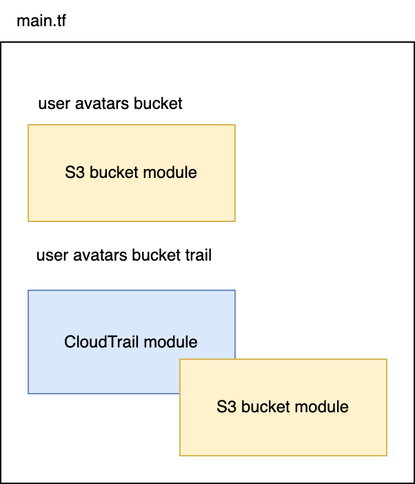

[Previous Exercise] | [Home] | [Next Exercise]

[Previous Exercise]: ../08_import-existing-resources-no-disruption/README.md
[Home]: ../../README.md
[Next Exercise]: ../10_trigger-dependant-pipelines-remote-state/README.md

---


# Exercise 9 - fast feedback when changing Terraform modules

⚠️ **This exercise requires that you've completed exercise 1** ⚠️

We're going to build out some infrastructure using nested Terraform modules.
In this case, it's an S3 bucket for storing user avatars, and a CloudTrail
Trail that tracks any actions on that bucket. If you haven't used it yet,
CloudTrail is a service that records AWS API actions made in a particular,
account, region or even across all regions in your whole AWS organisation.

CloudTrail doesn't record data actions by default. These include things like
files being uploaded to an S3 bucket, or a Lambda function being invoked. We're
going to simulate a scenario in which we want to record these data events for
our user avatars bucket, and so we'll explicitly enable them.

Here's the Terraform module structure, starting at `main.tf` in this project:



We're using the S3 bucket module twice: once at the top level of our `main.tf`,
and once as a nested module inside our CloudTrail module.

What happens if we want to change the S3 module, for example to add a public
access block? In a team, this process might look like:

* Make a change to the S3 bucket module.
* Have the change reviewed in a Pull Request.
* Merge the change, wait for a CI pipeline, get the published version.
* Make a change to the CloudTrail module.
* Have the change reviewed in a Pull Request.
* Merge the change, wait for a CI pipeline, get the published version.
* Try the change out in `main.tf`.

That's a lot of steps and a lot of time to get feedback! How can we make it
faster?

You can see in the `main.tf` that we're using a git repo for the `source` of
our modules:

```terraform
module "user_avatars_bucket" {
  source = "git@github.com:jSherz/things-you-should-learn-in-terraform.git?ref=terraform-module-s3"

  name = "user-avatars-${data.aws_caller_identity.this.account_id}-${data.aws_region.this.name}"
}

module "user_avatars_bucket_cloudtrail" {
  source = "git@github.com:jSherz/things-you-should-learn-in-terraform.git?ref=terraform-module-cloudtrail"

  bucket_name = module.user_avatars_bucket.name
}
```

We can get a faster feedback loop by cloning the module locally, updating the
source (temporarily), running a plan, and then pushing up our changes.

Start by checking out the two modules:

```bash
mkdir modules
cd modules
git clone --branch terraform-module-s3 git@github.com:jSherz/things-you-should-learn-in-terraform.git s3-bucket
git clone --branch terraform-module-cloudtrail git@github.com:jSherz/things-you-should-learn-in-terraform.git cloudtrail
cd ..
```

You should now have a directory structure that looks like this:

```
main.tf
modules/
modules/cloudtrail/
modules/cloudtrail/main.tf
modules/cloudtrail/...
modules/s3-bucket/
modules/s3-bucket/main.tf
modules/s3-bucket/...
```

Update the `source` directives in `main.tf`:

```terraform
module "user_avatars_bucket" {
  # source = "git@github.com:jSherz/things-you-should-learn-in-terraform.git?ref=terraform-module-s3"
  source = "./modules/s3-bucket"

  name = "user-avatars-${data.aws_caller_identity.this.account_id}-${data.aws_region.this.name}"
}

module "user_avatars_bucket_cloudtrail" {
  # source = "git@github.com:jSherz/things-you-should-learn-in-terraform.git?ref=terraform-module-cloudtrail"
  source = "./modules/cloudtrail"

  bucket_name = module.user_avatars_bucket.name
}
```

Change the account ID and region in your `terraform.tf`, initialise Terraform,
and then run a plan:

```bash
# Only if you haven't done this already
git clone git@github.com:jSherz/things-you-should-learn-in-terraform.git
cd exercises/09_fast-feedback-changing-modules

# Download any required provider(s)
terraform init

terraform plan
```

Ta-da! We can quickly make changes in the cloned versions of our module and go
straight to the plan phase.

You may remember that we've also got a nested module in
`./modules/cloudtrail/main.tf`. We can update the `source` there too and then
test even a nested module with instant feedback:

```terraform
module "cloudtrail_bucket" {
  # source = "git@github.com:jSherz/things-you-should-learn-in-terraform.git?ref=terraform-module-s3"
  source = "../s3-bucket"

  name   = "${var.bucket_name}-cloudtrail"
  policy = data.aws_iam_policy_document.cloudtrail_bucket.json
}
```

**NB:** you don't need to run a Terraform init after your changes.

I tend to have all the Terraform modules of a project checked out locally, and
so I often switch the `source` folder to something like
`/Users/jsj/projects/module-123` rather than cloning them into the current
directory.

## 🍎 What did we learn?

* We need to run Terraform plans with module changes to ensure they work.

* Nested modules can be very slow to test if we have to wait for code review
  and CI pipelines before we can try out our changes.

* We can temporarily change the `source` argument of a module to a local folder
  for faster testing!

## Further reading

* [Modules in the Terraform docs](https://developer.hashicorp.com/terraform/language/modules)

---

[Previous Exercise] | [Home] | [Next Exercise]
